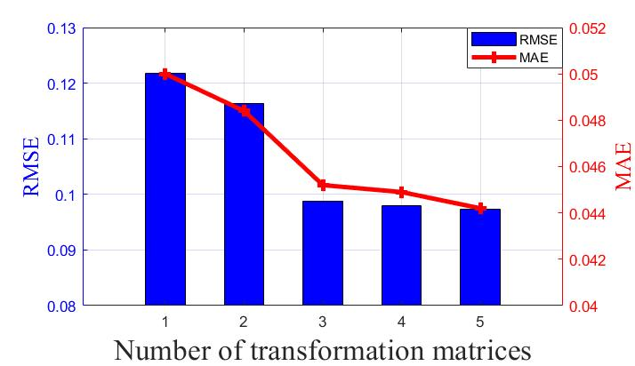
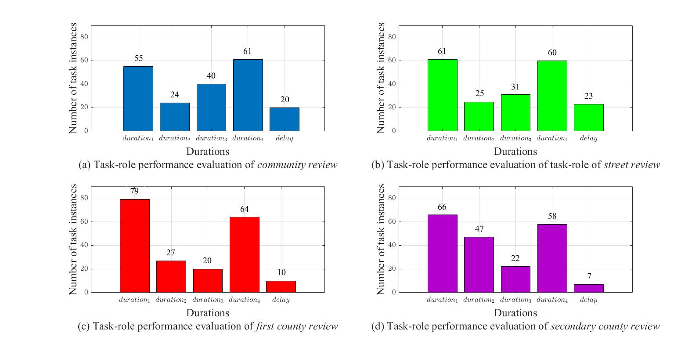
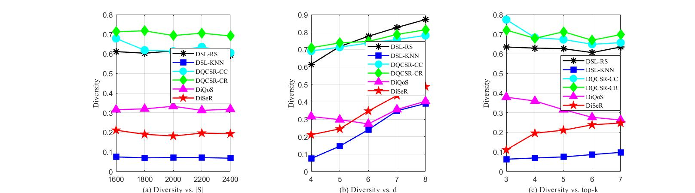
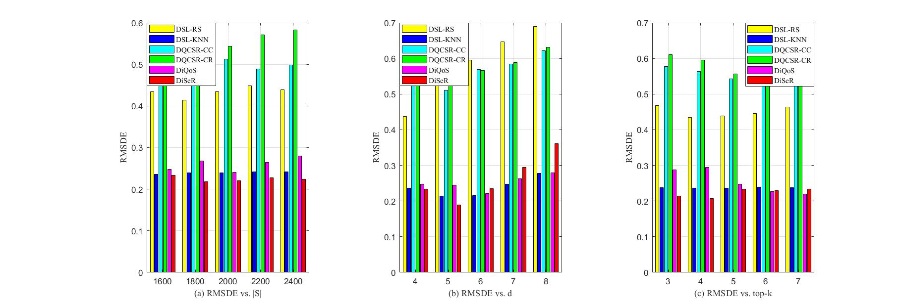
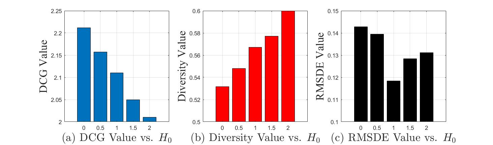

## MATLAB Plot Examples

### 【Examples 1】
```matlab
% version: R2021b
colororder({'0 0 1','1 0 0'})
x=1:5;
rmse=[0.1217,0.1164,0.0988,0.0979,0.0974];
mae=[0.05,0.0484,0.0452,0.0449,0.0442];
yyaxis left;

xlabel("Number of transformation matrices",FontSize=20,FontName='times new roman')
bar(rmse,0.5);
ylim([0.08,0.13])
ylabel('RMSE',FontSize=15,FontName='times new roman');
yyaxis right;

plot(x,mae,LineWidth=3,marker="+",MarkerSize=8);
ylim([0.04 0.052]);
ylabel('MAE',FontSize=15,FontName='times new roman');
grid on;
legend('RMSE','MAE')
```


----------------------
### 【Examples 2】
```matlab
% version: R2021b
% note: Numbers are added by inserting TEXT manually
subplot(2,2,1)
a=[55,24,40,61,20]
b=bar(a)
set(gca,'TickLabelInterpreter','latex');
set(gca,'xticklabels',{"$duration_1$","$duration_2$","$duration_3$","$duration_4$",'$delay$'},fontsize=10)
xlabel({'\fontname{Times New Roman}Durations','\fontname{Times New Roman}(a) Task-role performance evaluation of \itcommunity review'},fontsize=15)
ylabel("Number of task instances",fontsize=15,FontName='times new roman')
ylim([0,90])
grid on

subplot(2,2,2)
a=[61,25,31,60,23]
b=bar(a,'FaceColor','g')
set(gca,'TickLabelInterpreter','latex');
set(gca,'xticklabels',{"$duration_1$","$duration_2$","$duration_3$","$duration_4$",'$delay$'},fontsize=10)
xlabel({'\fontname{Times New Roman}Durations','\fontname{Times New Roman}(b) Task-role performance evaluation of task-role of \itstreet review'},fontsize=15)
ylabel("Number of task instances",fontsize=15,FontName='times new roman')
ylim([0,90])
grid on

subplot(2,2,3)
a=[79,27,20,64,10]
b=bar(a,'FaceColor','r')
set(gca,'TickLabelInterpreter','latex');
set(gca,'xticklabels',{"$duration_1$","$duration_2$","$duration_3$","$duration_4$",'$delay$'},fontsize=10)
xlabel({'\fontname{Times New Roman}Durations','\fontname{Times New Roman}(c) Task-role performance evaluation of \itfirst county review'},fontsize=15)
ylabel("Number of task instances",fontsize=15,FontName='times new roman')
ylim([0,90])
grid on

subplot(2,2,4)
a=[66,47,22,58,7]
b=bar(a,'FaceColor',[0.7 0 0.8])
set(gca,'TickLabelInterpreter','latex');
set(gca,'xticklabels',{"$duration_1$","$duration_2$","$duration_3$","$duration_4$",'$delay$'},fontsize=10)
xlabel({'\fontname{Times New Roman}Durations','\fontname{Times New Roman}(d) Task-role performance evaluation of \itsecondary county review'},fontsize=15)
ylabel("Number of task instances",fontsize=15,FontName='times new roman')
ylim([0,90])
grid on
```


----------------------
### 【Examples 3】
```matlab
% version: R2021b
% DCG vs. n
x=linspace(0,20,5);
y1=[0.61131772,0.60318549,0.61463409,0.62985014,0.59266533];
y2=[0.07452507,0.06992598,0.07191416,0.07128921,0.06805366];
y3=[0.67839719,0.61851504,0.61315904,0.63547266,0.60569269];
y4=[0.71264504,0.71722040,0.69305293,0.70514094,0.69075717];
y5=[0.31540583,0.31941858,0.33265992,0.31174363,0.31793637];
y6=[0.21086967,0.18983797,0.18106049,0.19598742,0.19246030];
subplot(1,3,1)
plot(x,y1,'-k*','LineWidth',1.5,'MarkerFaceColor','k','MarkerSize',10)
hold on
plot(x,y2,'-bs','LineWidth',1.5,'MarkerFaceColor','b','MarkerSize',10)
hold on
plot(x,y3,'-co','LineWidth',1.5,'MarkerFaceColor','c','MarkerSize',10)
hold on
plot(x,y4,'-gd','LineWidth',1.5,'MarkerFaceColor','g','MarkerSize',10)
hold on
plot(x,y5,'-m^','LineWidth',1.5,'MarkerFaceColor','m','MarkerSize',10)
hold on
plot(x,y6,'-rp','LineWidth',1.5,'MarkerFaceColor','r','MarkerSize',10)
grid on
xlabel('\fontname{Times New Roman}(a) Diversity vs. |S|')
ylabel('\fontname{Times New Roman}Diversity')
legend('\fontname{Times New Roman}DSL-RS','\fontname{Times New Roman}DSL-KNN','\fontname{Times New Roman}DQCSR-CC','\fontname{Times New Roman}DQCSR-CR','\fontname{Times New Roman}DiQoS','\fontname{Times New Roman}DiSeR','Location', 'Best')
set(gca,'looseInset',[0,25,0,5])
set(gca, 'XTicklabel',{'1600','1800','2000','2200','2400'}); 
% DCG vs. d
x=4:8;
y1=[0.61475412,0.71692065,0.77579916,0.82600890,0.87184054];
y2=[0.07452507,0.14550313,0.23996528,0.34831994,0.39035078];
y3=[0.69121786,0.71306208,0.73715300,0.75685314,0.78060865];
y4=[0.70994351,0.73782443,0.74592163,0.78610667,0.81302948];
y5=[0.31540583,0.29767221,0.27309618,0.35599823,0.40302305];
y6=[0.21086967,0.24476563,0.34698944,0.43611969,0.48650762];
subplot(1,3,2)
plot(x,y1,'-k*','LineWidth',1.5,'MarkerFaceColor','k','MarkerSize',10)
hold on
plot(x,y2,'-bs','LineWidth',1.5,'MarkerFaceColor','b','MarkerSize',10)
hold on
plot(x,y3,'-co','LineWidth',1.5,'MarkerFaceColor','c','MarkerSize',10)
hold on
plot(x,y4,'-gd','LineWidth',1.5,'MarkerFaceColor','g','MarkerSize',10)
hold on
plot(x,y5,'-m^','LineWidth',1.5,'MarkerFaceColor','m','MarkerSize',10)
hold on
plot(x,y6,'-rp','LineWidth',1.5,'MarkerFaceColor','r','MarkerSize',10)
grid on
xlabel('\fontname{Times New Roman}(b) Diversity vs. d')
ylabel('\fontname{Times New Roman}Diversity')
legend('\fontname{Times New Roman}DSL-RS','\fontname{Times New Roman}DSL-KNN','\fontname{Times New Roman}DQCSR-CC','\fontname{Times New Roman}DQCSR-CR','\fontname{Times New Roman}DiQoS','\fontname{Times New Roman}DiSeR','Location', 'Best')
set(gca,'looseInset',[0,25,0,5])
set(gca, 'XTicklabel',{'4','5','6','7','8'}); 
% DCG vs. k
x=3:7;
y1=[0.63462639,0.62918856,0.62616507,0.60632392,0.63466651];
y2=[0.06296438,0.06931125,0.07452507,0.08648496,0.09777978];
y3=[0.77424847,0.68261170,0.67313932,0.64872633,0.65695214];
y4=[0.72098947,0.67897599,0.71232662,0.66941704,0.69785377];
y5=[0.37925868,0.35955546,0.31540583,0.27654471,0.26254317];
y6=[0.11071504,0.19546272,0.21086967,0.23814924,0.24750323];
subplot(1,3,3)
plot(x,y1,'-k*','LineWidth',1.5,'MarkerFaceColor','k','MarkerSize',10)
hold on
plot(x,y2,'-bs','LineWidth',1.5,'MarkerFaceColor','b','MarkerSize',10)
hold on
plot(x,y3,'-co','LineWidth',1.5,'MarkerFaceColor','c','MarkerSize',10)
hold on
plot(x,y4,'-gd','LineWidth',1.5,'MarkerFaceColor','g','MarkerSize',10)
hold on
plot(x,y5,'-m^','LineWidth',1.5,'MarkerFaceColor','m','MarkerSize',10)
hold on
plot(x,y6,'-rp','LineWidth',1.5,'MarkerFaceColor','r','MarkerSize',10)
grid on
xlabel('\fontname{Times New Roman}(c) Diversity vs. top-k')
ylabel('\fontname{Times New Roman}Diversity')
legend('\fontname{Times New Roman}DSL-RS','\fontname{Times New Roman}DSL-KNN','\fontname{Times New Roman}DQCSR-CC','\fontname{Times New Roman}DQCSR-CR','\fontname{Times New Roman}DiQoS','\fontname{Times New Roman}DiSeR','Location', 'Best')
set(gca,'looseInset',[0,25,0,5])
set(gca, 'XTicklabel',{'3','4','5','6','7'});
```


----------------------
### 【Examples 4】
```matlab
% version: R2016a, R2021b
clf;clear
%example4
% DCG vs. n
x=linspace(0,20,5);
y1=[0.43374148,0.41350167,0.43448921,0.44862633,0.43919827];
y2=[0.23632110,0.23954280,0.23960905,0.24186533,0.24218608];
y3=[0.52925737,0.53301384,0.51256487,0.48908589,0.49892807];
y4=[0.55494351,0.56263972,0.54395178,0.57053645,0.58249439];
y5=[0.24796222,0.26798630,0.24002823,0.26442139,0.27945356];
y6=[0.23332089,0.21759096,0.22005740,0.22804344,0.22345221];
Y=[y1;y2;y3;y4;y5;y6];
Y=Y';
subplot(1,3,1)
b=bar(Y,'group');
hold on;
set(b(1),'facecolor','y')
set(b(2),'facecolor','b')
set(b(3),'facecolor','c')
set(b(4),'facecolor','g')
set(b(5),'facecolor','m')
set(b(6),'facecolor','r')
grid on
xlabel('\fontname{Times New Roman}(a) RMSDE vs. |S|')
ylabel('\fontname{Times New Roman}RMSDE')
legend('\fontname{Times New Roman}DSL-RS','\fontname{Times New Roman}DSL-KNN','\fontname{Times New Roman}DQCSR-CC','\fontname{Times New Roman}DQCSR-CR','\fontname{Times New Roman}DiQoS','\fontname{Times New Roman}DiSeR','Location', 'Best')
set(gca,'looseInset',[0,25,0,5])
set(gca, 'XTicklabel',{'1600','1800','2000','2200','2400'}); 
% DCG vs. d
x=4:8;
y1=[0.43692422,0.53107521,0.59485632,0.64726742,0.68944151];
y2=[0.23632110,0.21455607,0.21526262,0.24779609,0.27757141];
y3=[0.54761185,0.51128986,0.56831937,0.58479525,0.62124670];
y4=[0.55032248,0.55351824,0.56564050,0.58902278,0.63180261];
y5=[0.24796222,0.24507963,0.22063997,0.26236770,0.27975955];
y6=[0.23332089,0.18929373,0.23430133,0.29519748,0.36130204];
subplot(1,3,2)
Y=[y1;y2;y3;y4;y5;y6];
Y=Y';
b=bar(Y,'group');
hold on;
set(b(1),'facecolor','y')
set(b(2),'facecolor','b')
set(b(3),'facecolor','c')
set(b(4),'facecolor','g')
set(b(5),'facecolor','m')
set(b(6),'facecolor','r')
grid on
xlabel('\fontname{Times New Roman}(b) RMSDE vs. d')
ylabel('\fontname{Times New Roman}RMSDE')
legend('\fontname{Times New Roman}DSL-RS','\fontname{Times New Roman}DSL-KNN','\fontname{Times New Roman}DQCSR-CC','\fontname{Times New Roman}DQCSR-CR','\fontname{Times New Roman}DiQoS','\fontname{Times New Roman}DiSeR','Location', 'Best')
set(gca,'looseInset',[0,25,0,5])
set(gca, 'XTicklabel',{'4','5','6','7','8'}); 
% DCG vs. k
x=3:8;
y1=[0.46803422,0.43434589,0.43825871,0.44562756,0.46318505];
y2=[0.23793003,0.23700861,0.23632110,0.23918494,0.23743055];
y3=[0.57732976,0.56305301,0.54207951,0.53215540,0.52470173];
y4=[0.61059193,0.59583515,0.55614876,0.56148718,0.52707142];
y5=[0.28724937,0.29412256,0.24796222,0.22605833,0.21923843];
y6=[0.21403205,0.20773638,0.23332089,0.23004073,0.23298417];
subplot(1,3,3)
Y=[y1;y2;y3;y4;y5;y6];
Y=Y';
b=bar(Y,'group');
hold on;
set(b(1),'facecolor','y')
set(b(2),'facecolor','b')
set(b(3),'facecolor','c')
set(b(4),'facecolor','g')
set(b(5),'facecolor','m')
set(b(6),'facecolor','r')
grid on
xlabel('\fontname{Times New Roman}(c) RMSDE vs. top-k')
ylabel('\fontname{Times New Roman}RMSDE')
legend('\fontname{Times New Roman}DSL-RS','\fontname{Times New Roman}DSL-KNN','\fontname{Times New Roman}DQCSR-CC','\fontname{Times New Roman}DQCSR-CR','\fontname{Times New Roman}DiQoS','\fontname{Times New Roman}DiSeR','Location', 'Best')
set(gca,'looseInset',[0,25,0,5])
set(gca, 'XTicklabel',{'3','4','5','6','7'});
```


----------------------
### 【Examples 5】
```matlab
% version: R2021b
subplot(1,3,1)
a=[0,0.5,1,1.5,2]
b=[2.2115861,2.15729257154,2.10998199,2.04998199,2.00998199]

bar(b)
set(gca,"xticklabel",{'0','0.5','1','1.5','2'})
ylim([2,2.25])
txt=xlabel('(a) DCG Value vs. $H_{0}$')
set(txt,'interpreter','latex');
xlabel("(a) DCG Value vs. $H_{0}$",FontName='times new roman',FontSize=20)
ylabel("DCG Value",FontName='Times',FontSize=20)
grid on

subplot(1,3,2)
a=[0,0.5,1,1.5,2]

b=[0.531518,0.54817539,0.567141,0.577141,0.5998745]
bar(b,'red')
ylim([0.5,0.6])
txt=xlabel('(b) Diversity Value vs. $H_{0}$')
set(txt,'interpreter','latex');
set(gca,"xticklabel",{'0','0.5','1','1.5','2'})
xlabel("(b) Diversity Value vs. $H_{0}$",FontName='times new roman',FontSize=20)
ylabel("Diversity Value",FontName='Times',FontSize=20)
grid on

subplot(1,3,3)
a=[0,0.5,1,1.5,2]
y=[0.14279999999999995, 0.139457389999999926, 0.118422999999999976, 0.128422999999999967, 0.131156499999999903]
bar(y,'black')
ylim([0.1,0.15])
txt=xlabel('(c) RMSDE Value vs. $H_{0}$')
set(txt,'interpreter','latex');
set(gca,"xticklabel",{'0','0.5','1','1.5','2'})
xlabel("(c) RMSDE Value vs. $H_{0}$",FontName='Times New Roman',FontSize=20)
ylabel("RMSDE Value",FontName='Times',FontSize=20)
grid on
```

