## MATLAB Functions and Commands
<table style="width:100%">
  <tr>
    <td>subplot</td>
    <td>plot3</td>
    <td>sphere</td>
    <td>barh</td>
    <td>bar3</td>
    <td>cylinder</td>
    <td>area</td>
    <td>bar3h</td>
    <td>colorbar</td>
  </tr>
  <tr>
    <td>stem</td>
    <td>pie3</td>
    <td>line</td>
    <td>hist</td>
    <td>comet3</td>
    <td>rectangle</td>
    <td>pie</td>
    <td>stem3</td>
    <td>text</td>
  </tr>
  <tr>
    <td>comet</td>
    <td>spiral</td>
    <td>get set</td>
    <td>movie</td>
    <td>mesh</td>
    <td>patch</td>
    <td>getframe</td>
    <td>surf</td>
    <td>image</td>
  </tr>
</table>

[Matlab Plot Examples for Reference](Examples.md)

## Matlab Software Download
- [R2009a](https://pan.baidu.com/s/1LfePFjCCpGZw6r0Pw4HR3g)
- [R2016a](https://pan.baidu.com/s/1bbcMHcFj_uMkEgJ8hclT9g ) 
- [R2021b](https://pan.baidu.com/s/1cJ8jcHgEF9U_OKbxUaNGig?pwd=kang )

fetch code: kang

## Programming Style Guidelines
+ Always label plots
+ Take care to choose the type of plot to highlight the most relevant information

## Advanced Plotting TEchniques
### Plot Fucntions
```matlab
% version: R2016a
% Demonstrates subplot using a for loop
for i = 1:2
x = linspace(0,2*pi,10 *i);
y = sin(x);
subplot(1,2,i)
plot(x,y,'ko')
xlabel('x')
ylabel('sin(x)')
title(sprintf('%d Points',10 *i))
end
```
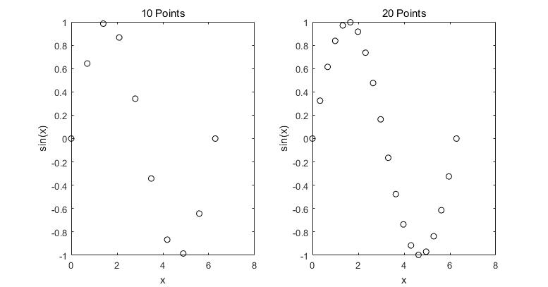

#### Method One
```matlab
% version: R2016a
% Subplot to show plot types
year = 2007:2011;
pop = [0.9 1.4 1.7 1.3 1.8];
subplot(2,2,1)
bar(year,pop)
title('bar')
xlabel('Year')
ylabel('Population')
subplot(2,2,2)
barh(year,pop)
title('barh')
xlabel('Year')
ylabel('Population')
subplot(2,2,3)
area(year,pop)
title('area')
xlabel('Year')
ylabel('Population')
subplot(2,2,4)
stem(year,pop)
title('stem')
xlabel('Year')
ylabel('Population')
```
#### Method Two
```matlab
% version: R2016a
% Demonstrates evaluating plot type names in order to use the plot functions and put the names in titles
year = 2007:2011;
pop = [0.9 1.4 1.7 1.3 1.8];
titles = {'bar', 'barh', 'area', 'stem'};
for i = 1:4
subplot(2,2,i)
eval([titles{i} '(year,pop)'])
title(titles{i})
xlabel('Year')
ylabel('Population')
end
```
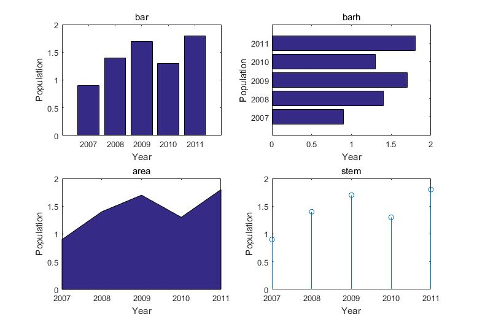

```matlab
% version: R2016a
% Data from a matrix in a bar chart
groupages = [8 19 43 25; 35 44 30 45];
bar(groupages);
xlabel('Group');
ylabel('Ages');
```
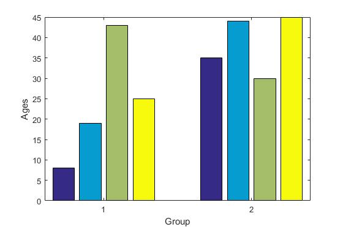

```matlab
% version: R2016a
% Data from a matrix in a bar chart
groupages = [8 19 43 25; 35 44 30 45];
bar(groupages,'stack');
xlabel('Group');
ylabel('Ages');
```
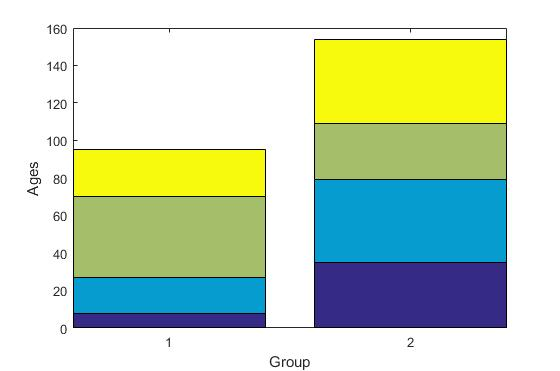

```matlab
% version: R2016a
% Histogram of data
quizzes = [10 8 5 10 10 6 9 7 8 10 1 8];
hist(quizzes);
xlabel('Grade');
ylabel('#');
title('Quiz Grades');
% >> c = hist(quizzes)
% c = 1 0 0 0 1 1 1 3 1 4
```
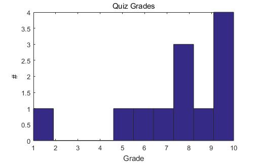

```matlab
% version: R2016a
% pie(vec): Pie chart showing percentages
pie([11 14 8 3 1]);
```
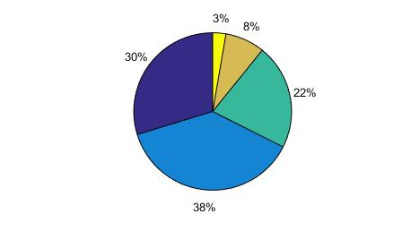

```matlab
% version: R2016a
% pie(vec): Pie chart with labels from a cell array
pie([11 14 8 3 1], {'A','B','C','D','F'});
```
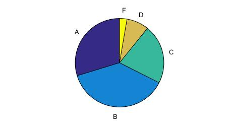

### Animation
```matlab
% version: R2016a
% animating a plot of sin(x) 
x = -2*pi : 1/100 : 2*pi;
y = sin(x);
comet(x,y);
% The end result looks similar to the result of plot(x,y)
```
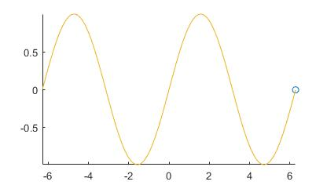


```matlab
% version: R2016a
% Shows a movie of the sin function
% The frames are captured in a loop using the built-in function getframe, and are stored in a matrix.
clear
x = -2*pi : 1/5: 2*pi;
y = sin(x);
n = length(x);
for i = 1:n
    plot(x(i),y(i),'r*')
    axis([min(x)-1 max(x)+1  min(y)-1 max(y)+1])
    M(i) = getframe;
end
movie(M)
```
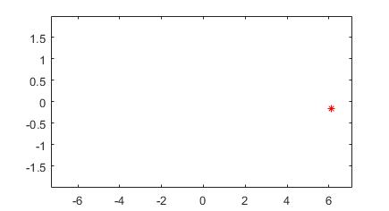

### Three-Dimensional Plots
```matlab
% version: R2016a
% 3D plot with a grid
x = 1:5;
y = [0 -2 4 11 3];
z = 2:2:10;
plot3(x,y,z,'k*');
grid;
xlabel('x');
ylabel('y');
zlabel('z');
title('3D Plot');
```
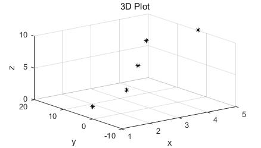

```matlab
% version: R2016a
% 3D bar chart
y = 1:6;
z = [33 11 5 9 22 30];
bar3(y,z);
xlabel('x');
ylabel('y');
zlabel('z');
title('3D Bar');
```
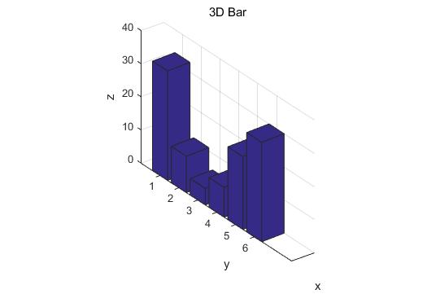


## Common Pitfalls
+ Forgetting that subplot numbers the plots rowwise rather than columnwise
+ Not realizing that the subplot function just creates a matrix within the Figure Window. Each part of this matrix must then be filled with a plot, using any type of plot function
+ Closing a Figure Window prematurely—the properties can only be set if the Figure Window is still open!
